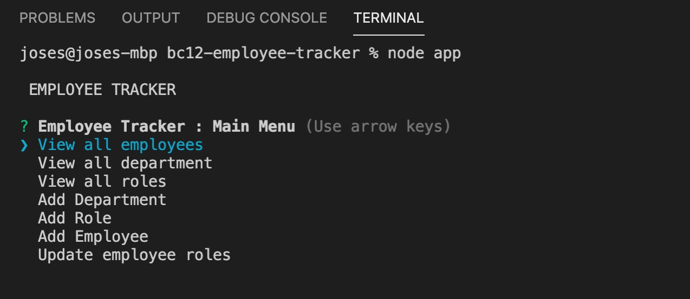
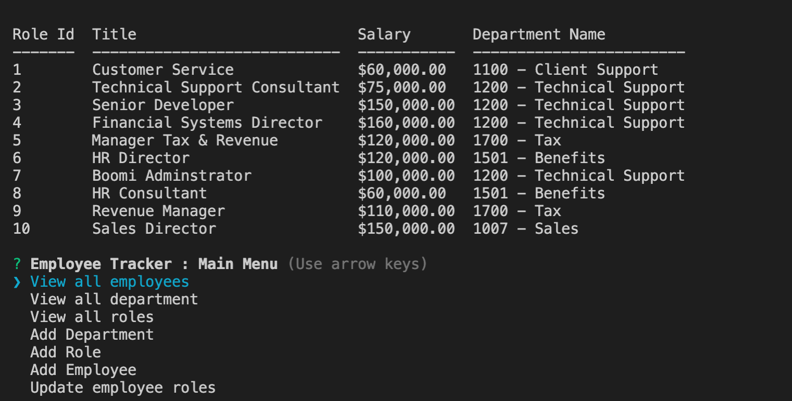

# Employee Tracker
 ````
## Project Description
Create a basic Content Management Systems, "Employee Tracker". To build a solution for managing a company's employees using node, inquirer, and MySQL.
````
````
## Table of Content
* [Demo](#Demo) 
* [Database schema](#Database schema) 
* [Tests](#System)
* [Questions](#Questions)
* [License](#License)   
````
## Demo

## Database schema:


## System

##

## 

````
## Questions
For any questions, please reach out to me:
    Find me in GitHub: josesanchezcapo | [My GitHub Profile](josesanchezcapo) | [Email Me](Follow me in Github to obtain my email.)
````
````
## Lincense
* GNU GENERAL PUBLIC LICENSE
````


